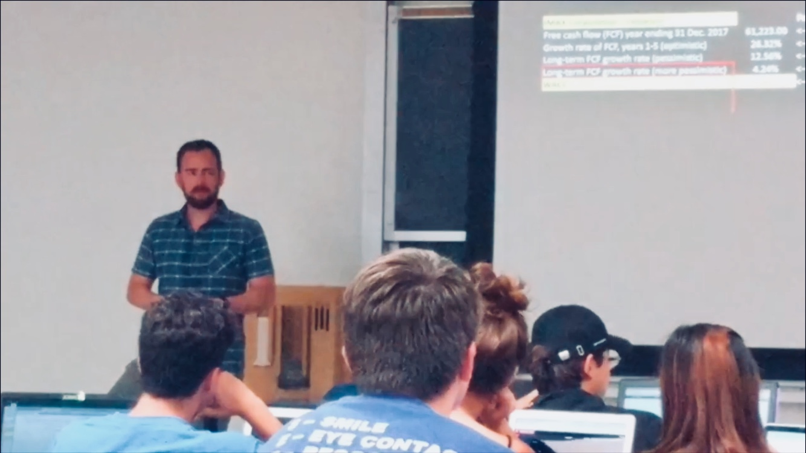

# Teaching

## Ongoing Engagements

## Website
[My Portfolio Website (links to external site)](https://www.leonshpaner.com/teaching/)

## Objective

To provide meaningful, demonstrative instruction useful for a wide target audience of all backgrounds

## Methods

* Data Exploration
* Pre-processing
* Data Visualization
* Statistical modeling
* Data modeling metrics

## Technologies
* R Programming (RStudio)
* Python Programming (RStudio and Jupyter Notebook)
* Word
* Excel
* Powerpoint
* Tableau

