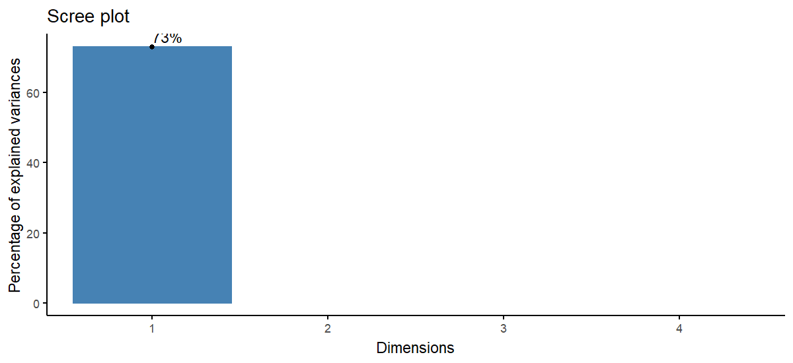

# Applying gganimate to Principal Component Analysis from iris dataset

## Objective
Principal Component Analysis (PCA) is a dimensionality reduction/ feature selection technique aimed at increasing the comprehensibility of a model with a goal of minimizing information loss in the process. Each principal component carries with it a percentage of variance that it accounts for in the model. Eigenvalues of the PCA function are obtained and a visualization is created to illustrate this dimensionality reduction technique in an animated fashion.

