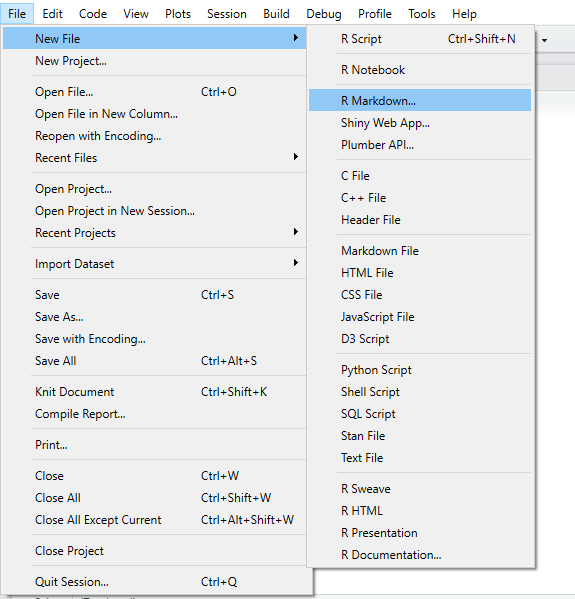
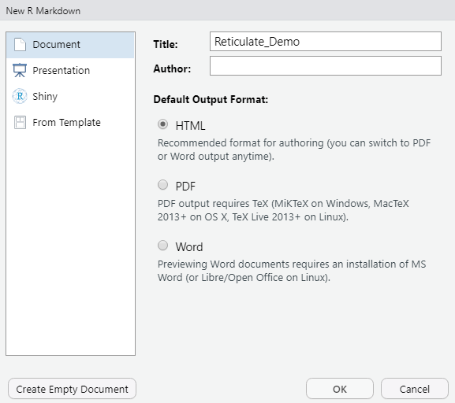
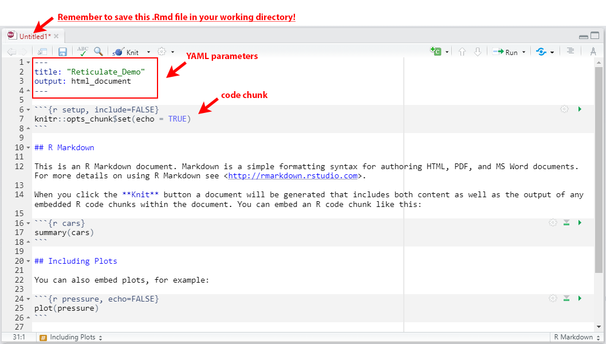

---
# Course title, summary, and position.
title: "Overview of RStudio with Reticulate Installation for Python in RStudio"
output:
  html_document: default
  pdf_document: default
summary: null
date: "`r Sys.Date()`"
draft: false  # Is this a draft? true/false
linktitle: null
weight: 2
lastmod: null
toc: false
type: docs
math: true
menu:
  rstudio:
    name: " 1. Reticulate Installation for Python in RStudio"
    weight: 2
---

```{r global.options, include = FALSE}
knitr::opts_chunk$set(
  cache       = TRUE,     # if TRUE knitr will cache the results to reuse in future knits
  fig.align   = 'center', # how to align graphics in the final doc. 'left', 'right', 'center'
  fig.path    = 'figs/',  # file path to the directory where knitr shall store the graphics files
 #results     = 'asis',   # knitr will pass through results without reformatting them
  echo        = TRUE,    # in FALSE knitr will not display code in the code chunk above it's results
  message     = FALSE,     # if FALSE knitr will not display any messages generated by code
  strip.white = TRUE,     # if FALSE knitr will not remove white spaces at the beg or end of code chunk
  warning     = FALSE)    # if FALSE knitr will not display any warning messages in the final document
```

<iframe width="560" height="315" src="https://www.youtube.com/embed/gNryvKSc8Pk" title="YouTube video player" frameborder="0" allow="accelerometer; autoplay; clipboard-write; encrypted-media; gyroscope; picture-in-picture" allowfullscreen></iframe>

## I. Installations
* [Installing the reticulate package in RStudio](#installing-the-reticulate-package-in-rstudio)
* [Using the reticulate package from R to install python libraries](#using-the-reticulate-package-from-r-to-install-python-libraries)

## II. Applications
* [Create an R Markdown file](#create-an-r-markdown-file)
* [Using R to read in and examine a dataset](#using-r-to-read-in-and-examine-a-dataset-)
* [Using Python to read in and examine a dataset](#using-python-to-read-in-and-examine-a-dataset)

&nbsp;
&nbsp; 

## <b> Installing the reticulate package in RStudio </b>
The following is a brief introduction on how to install the [reticulate](https://rstudio.github.io/reticulate/) package in RStudio so that you can integrate Python libraries into the IDE (workspace) that shares code with R. This will enable you to eventually [knit](https://www.rdocumentation.org/packages/knitr/versions/1.33/topics/knit) everything together with R and Python into one neat looking RMarkdown document.

The importance of determining and setting (correctly) the working directory cannot be stressed enough. Obtain the path to the working directory by running the `getwd()` function. Set the working directory by running the `setwd("...")` function, filling the parentheses inside with the correct path.

```{r, eval=F}
getwd() 
setwd()
```

To install specific packages, it is equally important to ensure to set the working directory to where base R is installed. In the console window, install the reticulate package by entering and running the following code using the `install.packages()` R syntax:

```{r, eval=F}
install.packages("reticulate")
```

## <b> Using the reticulate package from R to install python libraries </b>

The reticulate library allows us to install python packages in RStudio. However, to do that successfully, the syntax for calling the installation will change from `install.packages()` to `py_install()`.  
Load in the reticulate library and enter a new command for making a pandas (python) package installation through the library as follows:

```{r, eval=F}
library(reticulate)
py_install("pandas")
```

## <b> Create an R Markdown file </b>

Navigate to the "File" menu up top, click on "New File," follow by "R Markdown."




The following window will pop-up, prompting you to save the file according to various selections. Go ahead and name. In this case, an example title is set to "Reticulate_Demo." The author field can either be filled in or left blank, and it is best to select the "HTML" radio button since knitting (compiling) the outputs between PDF and HTML can always be switched between at a later time. Go ahead and click "OK."



Take notice that the code window has now become pre-populated with several lines of helper code for formatting/ starting the R Markdown file with the correct syntax. In the following illustration below:

* Lines 1-4 contain YAML parameters. YAML (short for "Yet Another Markup Language" or "YAML aint a Markup Language") is a necessary component of the initiation of any R Markdown file, and should be placed in the file up top starting with three `---`, and ending with the same `---`. The default values include "title" and "output."

* Lines 6-8 contain what is called a code chunk. A code chunk is a specific section of the R Markdown document where code-specific syntax is placed and executed. A code chunk always begins with three ticks $\text{```}$ followed by a `{}`, and ends with three ticks $\text{```}$ on a new line. To specify an R code chunk, place `r` inside the `{}`. Chunk options (or options for handling the chunk are always placed inside these curly braces). Some of these chunk options include:

  - `include = FALSE`negates the inclusion of code inside the chunk in the rendered output file, though it is still successfully executed and can be leveraged by succeeding chunks.
  - `fig,cap="..."` allows for a caption to be associated with graphical outputs
  
Global options in one "master" code chunk preceding all other code chunks. These global options will apply to all code chunks inside the R Markdown file, and can be adjusted on an as-needed-basis. Below is a commented out example of such code chunk. Feel free to use this for your R Markdown files:


```{r, include = TRUE}
#   ```{r global.options, include = FALSE}
#   knitr::opts_chunk$set(
#   cache       = TRUE,     # if TRUE knitr will cache the results to reuse in future knits
#   fig.align   = 'center', # how to align graphics in the final doc. 'left', 'right', 'center'
#   fig.path    = 'figs/',  # file path to the directory where knitr shall store the graphics files
#   results     = 'asis',   # knitr will pass through results without reformatting them
#   echo        = TRUE,     # in FALSE knitr will not display code in the code chunk above it's results
#   message     = FALSE,    # if FALSE knitr will not display any messages generated by code
#   strip.white = TRUE,     # if FALSE knitr will not remove white spaces at the beg or end of code chunk
#   warning     = FALSE)    # if FALSE knitr will not display any warning messages in the final document
#   ```
```




> At this stage, we are ready to code in both R and Python using different code chunks.

## <b> Using R to Read-In and Examine a Dataset </b>

1. Initiate an R code chunk.

```{r}
#    ```{r}
#
#
#    ```
```

2. Load the reticulate library 

```{r, include=TRUE}
library(reticulate)
```

3. Read in an example dataset into R using the ```read.csv("...", sep=";") function. This specific dataset is semicolon delimited, so the semicolon separator needs to be contained within the function. Assign the dataset to a dataframe called "white_wine." In R, it is best practice to use the left arrow `<-` for assignment statements.

```{r}
url="https://archive.ics.uci.edu/ml/machine-learning-databases/wine-quality/winequality-white.csv"
white_wine <- read.csv(url, sep=";")
```

4. Inspect the first six rows of the dataset by using the ```head()``` function. You should see a variety of properties (variables) associated with white wines. This is one "sanity" check for ensuring that the dataset was correctly read in.

```{r}
head(white_wine)
```

## <b> Using Python to Read-In and Examine a Dataset </b>

1. Initiate a Python code chunk.

```{python}
#    ```{python}
#
#
#    ```
```

2. Load the pandas library in Python. Read in the same dataset into Python using the ```pd.read_csv("...", sep=";")``` function. Once again, assign the dataset to a dataframe called "white_wine." In Python, the equals sign `=` is used for assignment statements.

```{python}
import pandas as pd
white_wine = pd.read_csv("https://archive.ics.uci.edu/ml/machine-learning-databases/\
wine-quality/winequality-white.csv",sep=";")
```

3. Inspect the first five rows of the dataset by using the ```df.head()``` function where `df` is your `white_wine` dataframe. You should see a variety of properties (variables) associated with white wines. This is one "sanity" check for ensuring that the dataset was correctly read in.

```{python}
white_wine.head()
```


